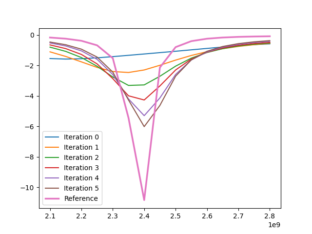

# HPC Student challenge project 2024

## Prerequisites

* Python (at least 3.9) on your system
* VS Code (recommended)

## Starting work

In this repository do:

```
python -m venv venv
venv\Scripts\activate
pip install -r requirements.txt
```

VS Code should now recommend this venv as python environment, if you open project (folder) in VS Code.

## Solver

Solver usage is shown in patch_antenna.py file. Just run it in python and see what happens! :)

Just running the existing file will plot the following:



Here we see that values get closer to reference with each iteration, but they are still very far. And the number of DOFs is already pretty high. The method chosen here to refine mesh is bad (obviously, we just put mesh refinement based on max value of electric field).

So we need to find a proper function to mark elements which we need to refine. And it is your task to do it! :)
